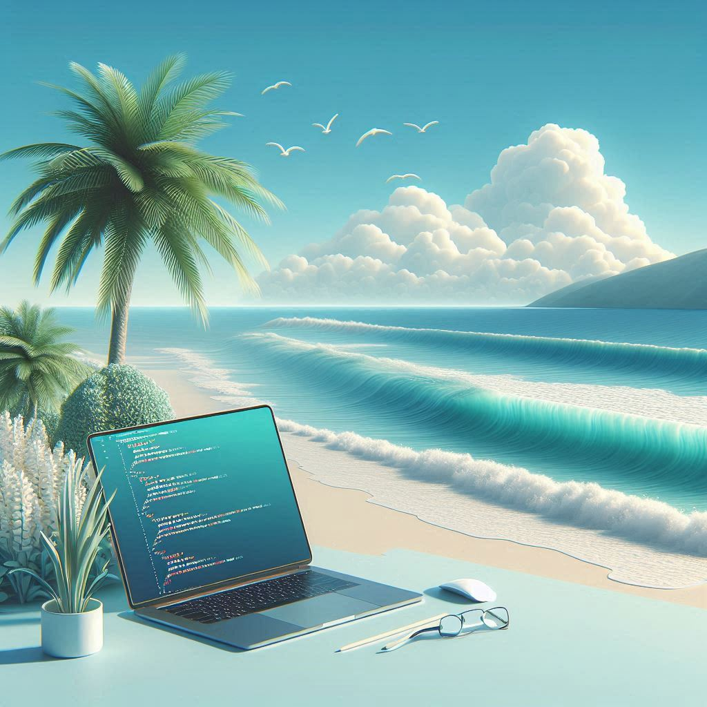

 

  

# 👨‍💻 Javier Ramos Fuster  
**Desarrollador Full Stack | Apasionado por la Innovación Tecnológica | Especialista en Backend**

---

## 🧑‍💼 Sobre mí  
Soy un desarrollador Full Stack, especializado en backend, con una gran pasión por la tecnología. Entre las principales herramientas que domino destaco **Python, HTML, CSS, JavaScript y SQL Server**.

A lo largo de mi trayectoria profesional, he trabajado en diversos proyectos tecnológicos, destacando mi paso por **KeepCoding**, donde pude profundizar y poner en práctica mis conocimientos. Además, he adquirido experiencia en empresas de renombre como **Apple**, **MediaMarkt** y **Amazon**, donde desarrollé habilidades en **atención al cliente**, **trabajo en equipo** y **orientación a objetivos**.

Mi formación académica siempre ha estado enfocada en el desarrollo Full Stack. Completé un **bootcamp intensivo de Full Stack Development**, donde adquirí conocimientos prácticos en tecnologías clave como **Python, HTML, CSS, JavaScript y SQL Server**. Esta experiencia me ha preparado para aplicar mis habilidades en proyectos reales y contribuir al éxito de un equipo tecnológico dinámico.

Mi objetivo profesional es seguir creciendo como desarrollador, enfrentando nuevos desafíos y aportando valor en equipos ágiles y colaborativos. La tecnología ha sido siempre mi gran pasión, y al fundar mi propia empresa, este interés se transformó en un compromiso por avanzar en el campo tecnológico, aprendiendo constantemente y aplicando mis habilidades para crear soluciones innovadoras.

---

## 🛠️ Tecnologías & Herramientas  
- **Lenguajes de programación:** Python, HTML, CSS, JavaScript, SQL Server  
- **Frameworks & Librerías:** frameworks como Django, React
- **Herramientas:** Git, Visual Studio Code  
- **Base de datos:** SQL Server 
- **Soft skills:** Trabajo en equipo, solución de problemas, comunicación efectiva  

---

## 📂 Proyectos Destacados  
### [📌 Proyectos en LinkedIn](https://www.linkedin.com/in/fuster/details/projects/1738746633897/single-media-viewer?type=LINK&profileId=ACoAACX5UNIBFo0dEuOV_l77iLvWrS02blGyyWE&lipi=urn%3Ali%3Apage%3Ad_flagship3_profile_view_base_projects_details%3BTKKbW3acTUe8Vz%2B8syhDgg%3D%3D)  
Accede a mis proyectos destacados directamente en LinkedIn.

---

## 🌱 ¿En qué estoy trabajando?  
Actualmente estoy perfeccionando mis habilidades en backend y explorando nuevas tecnologías como Java. También trabajo en nuevos proyectos colaborativos para seguir creciendo como desarrollador.

---

## 📫 Contacto  
- **Correo electrónico:** [ramos.fuster.javier@gmail.com](mailto:ramos.fuster.javier@gmail.com)  
- **LinkedIn:** [www.linkedin.com/in/fuster](https://www.linkedin.com/in/fuster)  
- **GitHub:** [https://github.com/fustte](#)  
- **Portafolio:** *(En construcción)*  

---

⭐ **Gracias por visitar mi perfil.** Si estás interesado en colaborar en proyectos innovadores o discutir ideas tecnológicas, no dudes en contactarme. 🚀

  

    